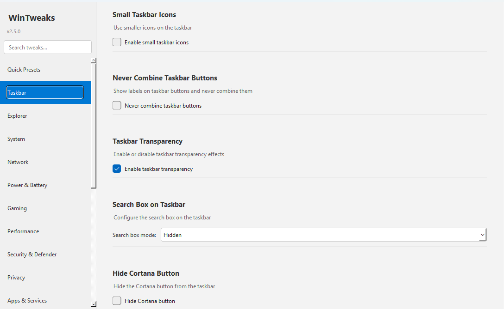
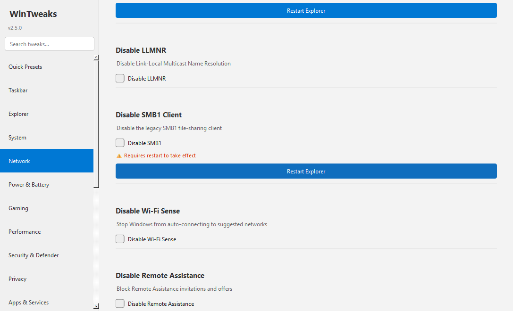

# WinTweaks v2.5.0

A Windows system-tweaking tool inspired by GNOME Tweaks — customize and optimize Windows settings through an intuitive graphical interface.  
**375 tweaks across 18 categories** • Quick Presets panel • Live search bar • No third-party dependencies beyond PyQt6.

---

## Screenshots

| Taskbar | Network |
|---|---|
|  |  |

---

## What's new in v2.5.0

| Feature | Details |
|---|---|
| **+120 new tweaks** | 100 tweaks across 5 brand-new tabs + 20 expansions to existing categories |
| **5 new tabs** | Display · Mouse & Input · Startup & Boot · Notifications · Developer Tools |
| **Quick Presets panel** | One-click bundles: Gaming Mode, Privacy Lock, Clean Desktop, Laptop Battery Saver, Dev Workstation |
| **Live search bar** | Type in the sidebar to filter all 375 tweaks in real time |
| **Restart Explorer button** | Instantly restart explorer.exe from any tweak that requires it |

---

## Requirements

- Windows 10 / 11
- Python 3.8+
- PyQt6 (`pip install -r requirements.txt`)
- Administrator privileges (for registry modifications)

---

## Installation & Usage

```bash
pip install -r requirements.txt
python src/main.py
```

Or run the compiled executable (requires administrator privileges).

```bash
python build.py   # build standalone .exe
```

---

## Quick Presets

| Preset | What it does |
|---|---|
| 🎮 **Gaming Mode** | Game Mode, HAGS, no mouse accel, disable Game Bar/DVR, high-performance power |
| 🔒 **Privacy Lock** | Disables telemetry, advertising ID, Cortana, location, activity history, ink diagnostics |
| 🖥️ **Clean Desktop** | Hides Search, Task View, Widgets, Chat; shows extensions; removes News & Interests |
| 🔋 **Laptop Battery Saver** | Power Saver plan, battery saver, short screen/sleep timeouts, disables background apps |
| 💻 **Dev Workstation** | Developer Mode, long paths, show hidden files/extensions, verbose startup, Hyper-V |

---

## All Tweaks by Category

### Taskbar (22)
- Small Taskbar Icons
- Never Combine Taskbar Buttons
- Taskbar Transparency
- Search Box on Taskbar
- Hide Cortana Button
- Hide Task View Button
- Hide Widgets Button
- Hide Chat Button
- Left-Align Taskbar
- Click on Last Active Window
- Disable Taskbar Grouping
- Show Seconds in Clock
- Taskbar Rounded Corners
- Taskbar Transparency Level
- Taskbar Position
- Auto-Hide Taskbar
- Always Show All Notification Icons
- Enable End Task from Taskbar
- Hide Meet Now (Skype) Button
- Lock Taskbar
- Hide Clock from Taskbar
- Show Desktop Button (Peek)

### Explorer (29)
- Show File Extensions
- Show Hidden Files
- Show Protected System Files
- Compact Mode in File Explorer
- Launch File Explorer To
- Show Full Path in Title Bar
- Disable Thumbnail Previews
- Disable Details Pane
- Disable Preview Pane
- Enable Item Checkboxes
- Always Show Ribbon
- Remove Quick Access
- Show 'This PC' on Desktop
- Show User Folder on Desktop
- Show Network on Desktop
- Show Recycle Bin on Desktop
- Show Control Panel on Desktop
- Disable Recent Files in Jump Lists
- Show All Folders in Navigation Pane
- Hide OneDrive Sync Ads in Explorer
- Auto-Expand Navigation Pane to Current Folder
- Show Full Path in Address Bar
- Skip Recycle Bin Delete Confirmation
- Show Encrypted/Compressed Files in Color
- Show Status Bar
- Show Folder Size in Tooltips
- Disable Simplified Sharing Wizard
- Run Explorer Windows in Separate Processes
- Icon Cache Size

### System (27)
- Dark Mode
- Accent Color on Title Bars
- Disable Snap Assist
- Disable Shake to Minimize
- Disable Edge Swipes
- Disable Sticky Keys Prompt
- Disable Filter Keys Prompt
- Disable Caps Lock Key
- Enable Num Lock on Startup
- Disable Auto Restart on BSOD
- Disable Error Reporting
- Disable Win+L Lock Hotkey
- Enable Long File Paths (>260 chars)
- Show Verbose Boot/Shutdown Status
- Disable UAC for Remote Admin Connections
- PrtScn Opens Snipping Tool
- Show Seconds in Taskbar Clock
- Disable Delivery Optimization P2P Upload
- Disable Consumer Experience / Cloud Features
- Disable Windows Startup Sound
- Hardware Clock Uses UTC
- Disable Automatic Maintenance
- Max HTTP Connections per Server
- Page File Initial Size
- Enable Legacy Boot Menu (F8)
- Disable Auto-Reboot on Kernel Crash
- Override Processor Display Name

### Network (19)
- Disable IPv6
- Disable LLMNR
- Disable SMB1 Client
- Disable Wi-Fi Sense
- Disable Remote Assistance
- Disable Remote Desktop
- Disable Teredo Tunneling
- Disable NetBIOS Name Release
- Disable Link-Local Auto-IP
- Disable Nagle Algorithm
- Disable QoS Bandwidth Reserve
- DNS Cache Max TTL
- Disable WPAD (Web Proxy Auto-Discovery)
- Enable RFC 1323 TCP Extensions
- Disable SMB Bandwidth Throttling
- Disable NetBIOS Broadcast Name Resolution
- Disable TCP Task Offloading
- Disable DNS Name Devolution
- Treat All Networks as Non-Metered

### Power & Battery (16)
- Disable Hibernation
- Disable Fast Startup
- Show 'Hibernate' in Power Menu
- Show 'Sleep' in Power Menu
- Show 'Lock' in Power Menu
- Disable CPU Power Throttling
- Disable Modern Standby Network
- Show Hidden Power Options in Control Panel
- Disable USB Selective Suspend
- Disable Screen Saver
- Disable Away Mode
- Disable Windows Power Throttling
- Disable NDU Network Data Usage Monitor
- Disable SleepStudy
- Enable Disk Write-Back Cache
- Disable Energy Estimation

### Gaming (24)
- Disable Game Bar
- Disable Game Mode
- Hardware-Accelerated GPU Scheduling
- Disable Fullscreen Optimizations
- Disable Mouse Acceleration
- Disable Network Throttling
- Maximize System Responsiveness
- Disable Xbox Game DVR
- Disable Memory Integrity (VBS)
- Boost GPU Priority for Games
- Disable Multi-Plane Overlay (MPO)
- Force Fullscreen Optimizations Off
- Enable DirectX Shader Cache
- Disable Pointer Precision (Raw Input)
- Use High Performance Power Plan
- Enable MMCSS NoLazyMode Timer
- Disable Xbox Live Auth Manager
- Disable Xbox Live Game Save
- Disable Spectre/Meltdown Mitigations
- Set Games Task SFIO Priority to High
- Disable Xbox Game Monitoring Service
- Disable Xbox Accessories Service
- Global Frame Rate Cap Hint
- Auto HDR

### Performance (30)
- Adjust for Best Performance
- Reduce Menu Delay
- Disable Thumbnail Cache
- Disable Drag Full Windows
- Reduce Hung App Timeout
- Reduce Wait-To-Kill App Timeout
- Disable Startup Delay
- Disable Minimize/Maximize Animations
- Auto-End Unresponsive Apps on Shutdown
- Disable Low Disk Space Warnings
- Keep Kernel in RAM
- Disable NTFS Last Access Timestamps
- Disable 8.3 Filename Creation
- Prefetcher Mode
- Foreground App Switch Speed
- Service Shutdown Timeout
- Clear Pagefile on Shutdown
- Raise CPU Priority for Games
- Foreground Process Priority Boost
- Enable SSD TRIM (Disable Delete Notification Throttle)
- Optimize Memory for Programs (Not Throughput)
- Disable SFC Boot Scan
- Heap Decommit Free Block Threshold
- Disable WMI Performance Adapter Service
- Crash Dump Type
- Max Internet Connections per Server
- NTFS MFT Zone Reservation
- Disable Write Combining
- Disable Spectre/Meltdown Mitigations (Performance)
- Foreground I/O Priority Boost

### Security & Defender (19)
- Set UAC to Never Notify
- Disable SmartScreen for Apps
- Disable SmartScreen for Edge
- Disable Defender Real-time Protection
- Disable Defender Cloud Protection
- Disable Defender Sample Submission
- Disable AutoRun for All Drives
- Disable AutoPlay
- Disable LM Password Hash Storage
- Force NTLMv2 Authentication Only
- Disable Windows Error Reporting Service
- Disable Default Admin Shares (C$, ADMIN$)
- Disable Windows Script Host
- Require SMB Packet Signing
- Require NLA for Remote Desktop
- Disable Remote Registry Service
- Disable Guest Account
- Disable Anonymous SAM Enumeration
- Enable Logon Event Auditing

### Privacy (22)
- Disable Telemetry
- Disable Advertising ID
- Disable Cortana
- Disable Recent Files in Quick Access
- Disable Frequent Folders in Quick Access
- Disable Feedback Notifications
- Disable Activity History
- Disable Inking & Typing Personalization
- Disable App Suggestions in Start Menu
- Disable Windows Tips & Tricks Notifications
- Disable Welcome Experience After Updates
- Disable Automatic Map Downloads
- Disable Lock Screen Ads & Spotlight Tips
- Disable Location Services
- Disable Camera Access (All Apps)
- Disable Microphone Access (All Apps)
- Disable App Launch Tracking
- Disable Ads and Suggested Content in Settings
- Disable Voice Activation for All Apps
- Disable App Diagnostics Access
- Disable Contacts Access (All Apps)
- Disable Documents Library Access (All Apps)

### Apps & Services (19)
- Disable OneDrive Auto-start
- Disable Cortana Auto-start
- Disable Microsoft Store Auto-update
- Disable Windows Search Indexing Service
- Disable SysMain (Superfetch)
- Disable Print Spooler
- Disable Connected User Experiences (DiagTrack)
- Disable Background Apps
- Disable Windows Tips and Suggestions
- Disable Auto-Restart for Updates
- Disable Silent Promoted App Installs
- Disable Bing Search in Start Menu
- Disable Microsoft Edge Preload
- Disable People Bar on Taskbar
- Disable News and Interests Widget
- Disable Feedback Hub Diagnostic Sampling
- Disable Shared Experiences (Cross-Device)
- Disable Windows Ink Workspace Button
- Disable Meet Now (Skype) Taskbar Button

### Context Menu (8)
- Use Classic Context Menu
- Add 'Open with Notepad'
- Add 'Open PowerShell Here as Admin'
- Add 'Open Command Prompt Here as Admin'
- Add 'Take Ownership'
- Add 'Copy as Path' to Context Menu
- Remove 'Share' from Context Menu
- Remove 'Cast to Device' from Context Menu

### Personalization (18)
- Disable Lock Screen
- Disable Login Screen Blur
- Colorize Start and Taskbar
- Disable Transparency Effects
- Disable Window Animations
- Disable Window Shadows
- Disable Rounded Corners
- Verbose Boot Messages
- Disable Boot Logo
- Disable Cursor Shadow
- Disable System Beep
- Disable Error Beeps
- Disable Lock Screen Tips
- Disable Windows Spotlight on Lock Screen
- Window Border Width
- Window Padded Border
- Disable ClearType Font Smoothing
- Disable Translucent Selection Rectangle

### Accessibility (22)
- High Contrast Mode
- Large Mouse Cursors
- Mouse Trails
- Snap To Default Button
- Toggle Keys Beep
- Mouse Keys
- Sound Sentry
- Show Sounds
- Thick Text Cursor
- Disable Cursor Blink
- Reduce Scroll Lines
- Large Desktop Icons
- Always Underline Shortcuts
- Mouse Double-Click Speed
- Mouse Hover Time
- Keyboard Repeat Delay
- Keyboard Repeat Rate
- Mouse Pointer Speed
- Scroll Inactive Windows on Hover
- Touchpad Natural (Reverse) Scrolling
- Cursor Size
- Enable ClickLock

### Display *(new in v2.5.0)* (22)
- DPI Scaling Awareness Mode
- Custom Font DPI Override
- Night Light (Blue Light Filter)
- Show Snap Layouts on Hover
- Snap Window Suggestions
- Show Taskbar on All Monitors
- Multi-Monitor Taskbar Button Mode
- Show All Virtual Desktop Windows on Taskbar
- Alt+Tab Shows All Virtual Desktop Windows
- Desktop Wallpaper JPEG Quality
- Dynamic Refresh Rate (DRR)
- Disable DWM Hardware Compositing
- Disable GDI DPI Scaling for Blurry Apps Fix
- Monitor Sleep Timeout on AC Power (minutes)
- ClearType Font Rendering
- Text Cursor Blink Rate
- Taskbar Thumbnail Preview Delay
- Show Color Calibration on Startup
- Disable Display Auto-Rotation Lock
- Hide All Desktop Icons
- Snap Windows Across Monitor Boundaries
- Window Open/Close Animation Speed

### Mouse & Input *(new in v2.5.0)* (22)
- Mouse Sensitivity (Control Panel)
- Enhance Pointer Precision (Mouse Acceleration)
- Mouse Wheel Scroll Lines
- Mouse Wheel Horizontal Scroll Characters
- Double-Click Speed
- Swap Primary/Secondary Mouse Buttons
- Touchpad Sensitivity
- Touchpad Tap to Click
- Touchpad Two-Finger Tap (Right-Click)
- Touchpad Three-Finger Tap Action
- Touchpad Pinch to Zoom
- Touchpad Scroll Direction
- Force Raw Mouse Input
- Disable Keyboard Layout Switching Shortcut
- IME Candidate Window Mode
- NumLock State at Login Screen
- Keyboard Backlight Timeout
- Mouse Hover Dwell Time
- Disable Touchscreen Input
- Show Mouse Location on Ctrl Press (Sonar)
- Snap Pointer to Default Button
- Disable Controller Vibration (System-wide hint)

### Startup & Boot *(new in v2.5.0)* (20)
- Boot Menu Timeout
- Verbose Boot/Shutdown Messages
- Auto-Restart After BSOD
- Beep on BSOD
- Overwrite Existing Crash Dump
- Enable Last Known Good Configuration
- Startup Program Launch Delay
- Disable Windows Startup Animation
- Disable First Logon Animation
- Custom Login Screen Legal Notice Title
- System Shutdown Wait Timeout
- Fast Startup / Hiberboot
- Boot with Multiple Processors
- Application Recovery Interval
- System Event Log Maximum Size
- Application Event Log Maximum Size
- Disable Windows Error Reporting UI
- Disable Background App Refresh on Battery
- Disable App Auto-Relaunch After Update Reboot
- Clear Temp Folder on Startup

### Notifications *(new in v2.5.0)* (18)
- Disable Focus Assist (Do Not Disturb)
- Toast Notification Duration
- Disable All Notifications
- Disable Notifications on Lock Screen
- Show App Badges on Taskbar Buttons
- Disable Action Center
- Suppress Update Restart Notifications
- Disable Windows Security Center Alerts
- Disable System Notification Sounds
- Disable New App Installation Notifications
- Disable Device Driver Install Balloon
- Low Battery Notification Level
- Disable Explorer Balloon Tip Notifications
- Disable Network Location Wizard Notification
- Disable Printer Install Toast Notification
- Disable Microsoft Store Promotional Notifications
- Disable App Suggestion Notifications
- Disable OneDrive Sync Notifications

### Developer Tools *(new in v2.5.0)* (18)
- Enable Developer Mode
- Enable Windows Sandbox
- PowerShell Execution Policy
- Remote Desktop Port
- RDP Session Idle Timeout
- Show Detailed File Operation Progress
- WSL2 Memory Limit Hint
- Hyper-V Hypervisor Launch Type
- Windows Symbol Server Path
- Force BSOD via Keyboard (Debug)
- Allow Remote Print Spooler Connections
- Security Event Log Maximum Size
- Disable PC Health Check Telemetry
- Disable Error Reporting Queue
- Enable Telnet Client
- Windows Insider Program Channel
- Disable Windows Feedback Notifications
- Enable Win32 Long Path Support

---

## Architecture

```
src/
├── main.py                  # Entry point
├── main_window.py           # MainWindow, CategoryPage, TweakWidget, SearchResultsPage
├── tweaks.py                # All 375 Tweak definitions (TweakCategory, Tweak, RegistryChange)
├── tweak_manager.py         # TweakManager — applies/reads tweaks, special handlers
├── registry_utils.py        # Registry helpers, is_admin()
├── personalization_tab.py   # Custom Personalization panel
├── presets_panel.py         # Quick Presets panel (new in v2.5.0)
├── video_wallpaper_panel.py # Video wallpaper support
├── icon_manager.py          # Icon management
├── wallpaper_icons_panel.py # Wallpaper + icons panel
├── custom_fonts_panel.py    # Custom fonts panel
└── node_editor/             # Node-based tweak workflow editor
```

---

## License

MIT
